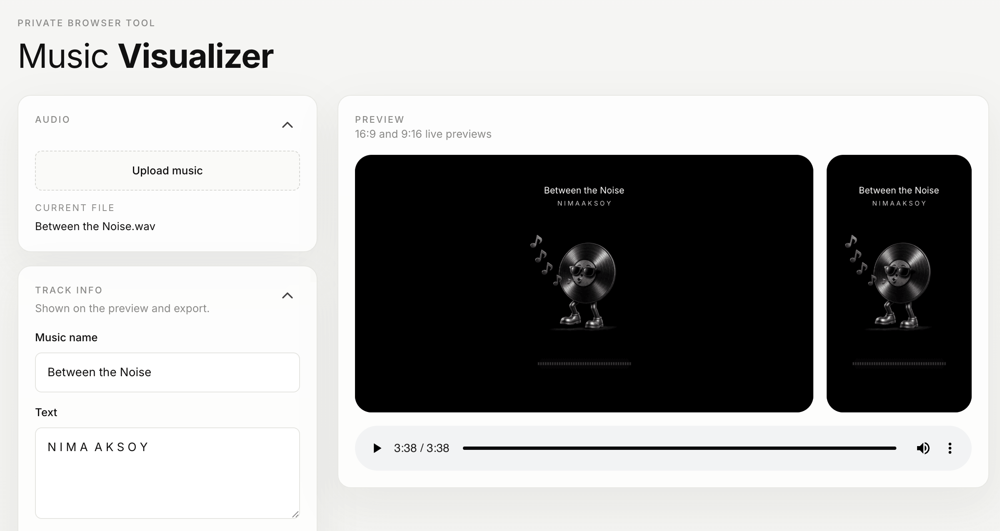

# Music Visualizer



Browser-based music visualizer for turning a local audio file into a shareable landscape or portrait video. Everything runs in your browser — no uploads, no accounts, no tracking.

## Demo

- Live: [mv.nimaaksoy.com](https://mv.nimaaksoy.com)
- Sponsor: [Bowora.com](https://bowora.com)

## Features

- **Pick your canvas** — onboarding modal asks for 16:9 or 9:16; switch any time from the header.
- **Upload local audio** — your file never leaves the browser.
- **Track info & extra text** — title and freeform text with independent position / size controls.
- **Visualizer styles** — Rounded bars, Reflective bars, Dot spectrum, Liquid wave, Bloom line, Aurora bands, Spectrum hills, Frequency rings, plus an Off option to disable the visualizer entirely.
- **Particle layer** — Dust, Snow, Embers, Bubbles, Confetti, Sparks, Rain, Film grain, Glitch, Light leaks. Default off, intensity slider.
- **Mood backgrounds** — Mesh, Noir, Onyx, Gold, Silver, Chrome, Pastel, Sage, Dusk, Vapor, Ocean, Crimson. Or upload your own image or video.
- **Trim before export** — dual-handle range slider picks the segment to render.
- **Render quality** — 720p / 1080p / 1440p / 4K, defaults to 1080p for fast exports.
- **Accordion sidebar** — one panel open at a time, easy to navigate.

## Privacy

- No backend
- No cloud processing
- No analytics, no cookies, no tracking
- Nothing is uploaded unless you choose to publish the exported file yourself

## Tech

- Vanilla HTML, CSS, and JavaScript — no build step
- Web Audio API for audio analysis
- Canvas 2D for rendering
- MediaRecorder for local video export
- IntersectionObserver pauses rendering when the canvas is off-screen

## Local Run

You can open `index.html` directly, but a local server is more reliable for browser media APIs.

```bash
python3 -m http.server 4173
```

Then open [http://localhost:4173](http://localhost:4173).

## Credits

- Concept inspiration: [AlexVestin/musicvid.org](https://github.com/AlexVestin/musicvid.org).
- Typography uses [Inter](https://github.com/rsms/inter) and [JetBrains Mono](https://github.com/JetBrains/JetBrainsMono) via Google Fonts.
- Sponsor support by [Bowora.com](https://bowora.com).
- This repository is a standalone vanilla HTML/CSS/JavaScript implementation and does not bundle code from `musicvid.org`.
